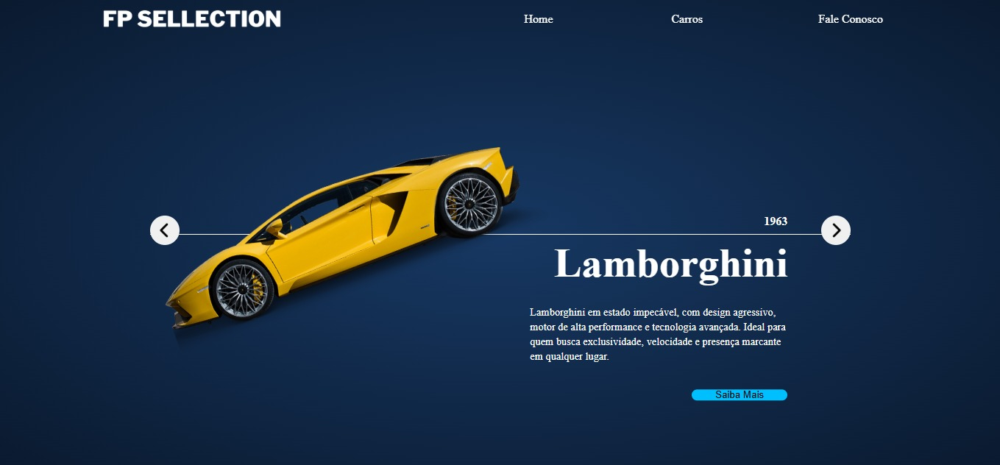

# 🚗 Carrossel de Carros Animado

Projeto Front-End de um carrossel interativo de carros, onde o usuário pode navegar entre diferentes modelos utilizando setas de navegação. Em telas menores, o projeto conta com um menu hambúrguer para facilitar a navegação.

## 📸 Preview


## 🛠️ Tecnologias Utilizadas
- HTML5
- CSS3
- JavaScript

## ⚙️ Funcionalidades
- Navegação entre carros através das setas
- Animação aplicada ao carro ao mudar de slide
- Transições suaves entre os modelos
- Menu hambúrguer para navegação em telas mobile
- Layout moderno e focado em apresentação visual

## 🎨 Animações
As animações são acionadas a cada mudança de carro, criando um efeito visual fluido que destaca o modelo exibido e melhora a experiência do usuário.

## 📚 Objetivo do Projeto
Projeto desenvolvido com fins educacionais, com o objetivo de praticar:
- Manipulação do DOM com JavaScript
- Controle de estado de um carrossel
- Criação de menu hambúrguer responsivo
- Animações e transições com CSS
- Integração entre HTML, CSS e JavaScript

## 📱 Responsividade
O layout foi adaptado para diferentes tamanhos de tela, utilizando menu hambúrguer em dispositivos mobile para melhorar a usabilidade e a organização da navegação.

## 🚀 Como executar o projeto
```bash
# Clone o repositório
git clone https://github.com/mellacer/FP-Sellection

# Acesse a pasta do projeto
cd FP-Sellection

# Abra o arquivo index.html no navegador
